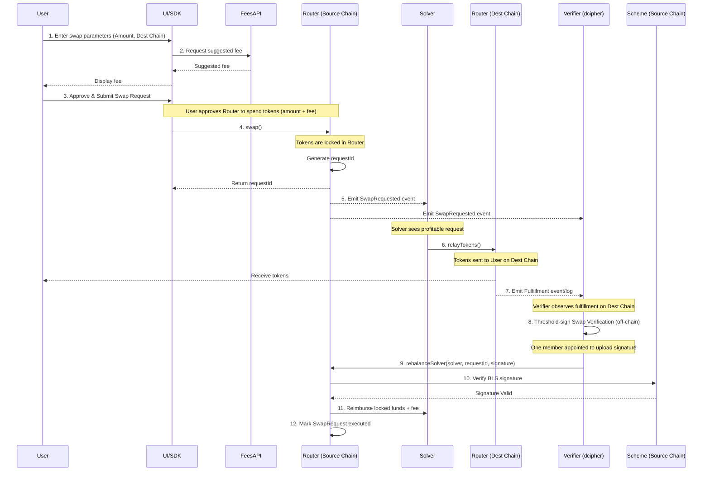

# Architecture Deep Dive

This document explores the end-to-end lifecycle of a cross-chain swap in the OnlySwaps protocol, detailing the interactions between the user, the contracts, the solvers, and the verification layer.

## Architectural Principles

1.  **Intent-Based:** Users broadcast an intent (Swap Request) rather than executing a predefined path.
2.  **Optimistic Fulfillment:** Solvers provide liquidity instantly on the destination chain, trusting the dcipher committee to reimburse them.
3.  **Decentralized Verification:** A threshold signature scheme (BLS BN254) ensures that no single entity can authorize the release of funds.
4.  **Upgradeable (UUPS):** Core contracts utilize the UUPS pattern, gated by time-locked, BLS-authorized governance via the `ScheduledUpgradeable` mechanism.
5.  **Domain Separation:** Strict domain separation is enforced for all BLS signatures (e.g., "swap-v1" vs "upgrade-v1") to prevent replay attacks.

## The Swap Lifecycle

The following sequence diagram illustrates the complete flow of a swap, from fee discovery to final verification and reimbursement.

### Detailed Explanation

#### Step 0: Fee Discovery (Steps 1-2)

The user interface (using `onlyswaps-js`) queries the Fees API to determine a competitive fee based on current market conditions, maximizing the chance of quick fulfillment.

#### Step 1: Swap Request Initiation (Steps 3-5)

1.  The User approves the `Router` contract on the Source Chain to spend the required amount (`amount + fee`).
2.  The User calls the `swap()` function.
3.  The `Router` locks the tokens, generates a unique `requestId`, and emits a `SwapRequested` event.
4.  Solvers and dcipher Verifiers observe this event.

#### Step 2: Solver Fulfillment (Steps 6-7)

1.  A Solver identifies the request and decides the fee is acceptable.
2.  The Solver calls `relayTokens()` on the Destination Chain's `Router`.
3.  The tokens are transferred to the user's recipient address on the Destination Chain.
4.  This fulfillment action emits an event on the Destination Chain.

#### Step 3: Verification and Reimbursement (Steps 8-12)

1.  The dcipher Verifiers observe the fulfillment event on the Destination Chain.
2.  The committee members coordinate off-chain to generate a Threshold BLS signature attesting to the fulfillment.
3.  A designated member submits this aggregated signature to the Source Chain `Router` via the `rebalanceSolver()` function.
4.  The `Router` verifies the signature against the committee's public key stored in the `Scheme` contract.
5.  If the signature is valid, the `Router` releases the user's locked funds plus the fee to the Solver and marks the request as `executed`.

## Status Tracking: Executed vs. Fulfilled

It is crucial to distinguish between the status on the source chain and the destination chain:

  * **`fulfilled` (Destination Chain):** Indicates that the Solver has completed the transfer to the user. Tracked in the `SwapRequestReceipt`.
  * **`executed` (Source Chain):** Indicates that the dcipher network has verified the fulfillment and the Solver has been reimbursed. Tracked in the `SwapRequestParameters`.

A swap is only considered fully complete when it is both `fulfilled` on the destination and `executed` on the source.
