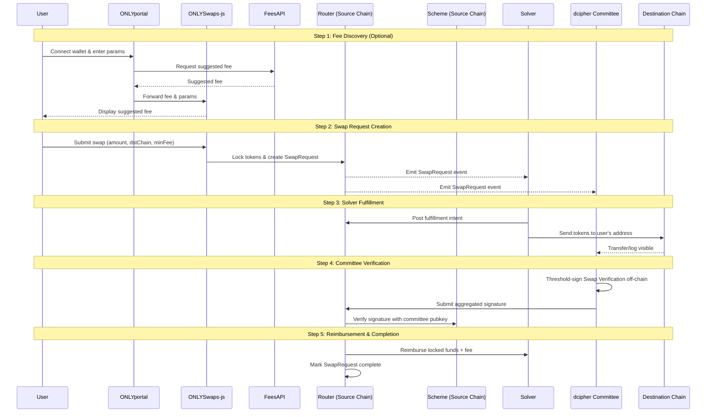

# Protocol Architecture

The ONLYSwaps protocol utilizes an intent-based architecture secured by threshold cryptography to facilitate cross-chain token transfers. This involves coordination between Users, Solvers, the decentralized dcipher committee, and the Router contracts deployed on supported chains.

## Core Components

### Router Contract (Vaults)

The `Router` contract is the central component of ONLYSwaps, deployed on every supported chain. It acts as an on-chain order book and manages the lifecycle of a swap. It also functions as a temporary vault for user funds.

Its key responsibilities include:
1.  **Locking Funds:** Accepting funds from users and creating `SwapRequest` entries.
2.  **Swap Fulfillment:** Facilitating the delivery of funds on the destination chain by Solvers.
3.  **Verification and Reimbursement:** Verifying signatures from the dcipher committee to confirm fulfillment and subsequently releasing the locked funds (plus the fee) to the Solver on the source chain.

The Router is implemented using the UUPS upgradeable pattern, ensuring the protocol can evolve while maintaining security through time-locked, BLS-gated upgrades (via the `ScheduledUpgradeable` contract).

### Solvers

Solvers are off-chain actors who provide liquidity. They monitor the Router contracts for open `SwapRequest` events. When a request meets their criteria, they fulfill it on the destination chain and are later reimbursed on the source chain upon verification.

### dcipher Committee (Verifiers)

The dcipher committee members run the `ONLYSwaps-verifier` application. They observe events on the destination chain. When a Solver successfully fulfills a request, the committee members collaborate off-chain to generate a threshold signature verifying this action.

### Scheme Contract (BLSBN254SignatureScheme)

The `Scheme` contract contains the cryptographic logic and the committee's public key necessary for the Router to verify the signatures generated by the dcipher committee. ONLYSwaps uses the `BLSBN254SignatureScheme`.

This scheme implements BLS signature verification over the BN254 curve. Crucially, it enforces **domain separation**. This ensures that a signature intended for one purpose (e.g., `"swap-v1"`) cannot be replayed for another (e.g., `"upgrade-v1"`). Separate instances of the scheme are deployed for swap verifications and contract upgrades.

## Cross-Chain Flow

The following sequence diagram illustrates the end-to-end flow of a cross-chain swap:

### Flow Steps

1. **Fee Discovery (Optional):** User connects wallet and enters swap parameters via ONLYportal, which queries the Fees API for suggested fees based on current conditions.

2. **Swap Request Creation:** User submits swap transaction through ONLYSwaps-js SDK. Router contract locks user's tokens and emits `SwapRequested` event.

3. **Solver Fulfillment:** Solver monitors Router contract, posts fulfillment intent, and sends tokens to user's address on destination chain.

4. **Committee Verification:** dcipher committee members observe the transfer and collaborate off-chain to generate BLS threshold signature.

5. **Reimbursement & Completion:** Router verifies signature, releases locked funds to Solver, and marks SwapRequest as complete.

## Summary

OnlySwaps represents a paradigm shift in cross-chain token transfer architecture. By combining BLS threshold signatures with a solver-based fulfillment model, it addresses the fundamental limitations of both pool-based systems (like Stargate) and oracle-dependent solutions (like LayerZero).

### Key Innovations:

- **Cryptographic Security**: BLS signatures provide mathematical guarantees.
- **Economic Efficiency**: Just-in-time liquidity eliminates capital requirements.
- **Operational Simplicity**: Single signature verification replaces complex validation.
- **Decentralized Architecture**: Threshold signatures eliminate single points of failure.
- **Developer-Friendly**: Standard ERC-20 operations with familiar interfaces.

As the multi-chain ecosystem evolves, OnlySwaps provides the infrastructure for seamless, secure, and efficient cross-chain value transfer that scales with the growing demands of decentralized finance.

