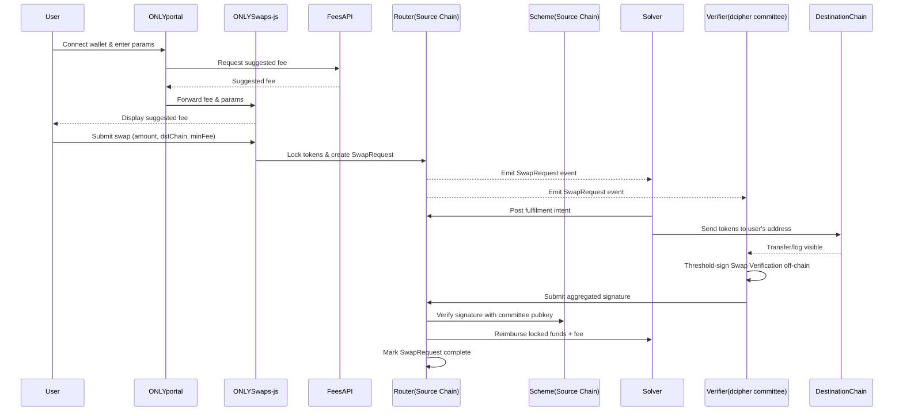

# Architecture

This section walks through the on‑chain/off‑chain flow and the core components: Router, BLS signature scheme, dcipher committee, solvers, and fees.

## Cross‑chain sequence



The diagram reflects the protocol lifecycle: user request, solver fulfillment on destination, then committee verification and solver reimbursement on the source chain. 

## Components

### Router (source chain)

* Order book & escrow: holds user funds when a request is created; emits `SwapRequested`. 
* Admin surface: allow‑list destination chain IDs and manage token mappings. (`permitDestinationChainId`, `setTokenMapping`, `block…`, `remove…`). 
* Verification fee: protocol BPS‑based fee charged on swap amount (bounded by `MAX_FEE_BPS`). 
* Upgrades: UUPS behind `ScheduledUpgradeable`, gated by BLS signatures (domain‑separated).  

### Signature scheme and domain separation

ONLYSwaps uses a BN254 BLS signature scheme with application‑scoped domain separation (e.g., `"swap-v1"`, `"upgrade-v1"`). A dedicated contract wraps the library:

```solidity
contract BLSBN254SignatureScheme is BN254SignatureScheme {
  constructor(uint256[2] memory x, uint256[2] memory y, string memory application)
    BN254SignatureScheme(BLS.g2Marshal(BLS.PointG2({x: x, y: y})), application) {}
}
```

Deploy separate instances per domain, and inject addresses into `Router.initialize` so the Router verifies the correct domain for each action. 

### Cross‑chain routing primitives

* Message formation: derive BLS messages with `swapRequestParametersToBytes` and sign off‑chain; `rebalanceSolver` settles the solver after fulfillment. 
* Destination configuration: allow‑list the destination chain and set token mappings before enabling swaps. 

### Fees path

* User‑chosen solver fee (suggested by the Fees API) motivates solvers to fulfill quickly. 
* Verification fee compensates the dcipher committee for threshold verification on the source chain.  

### Upgrade and validator rotation

Upgrades and validator changes are scheduled and require BLS authorization over a canonical message (`contractUpgradeParamsToBytes` / `blsValidatorUpdateParamsToBytes`), with an enforced minimum delay (default two days).  

