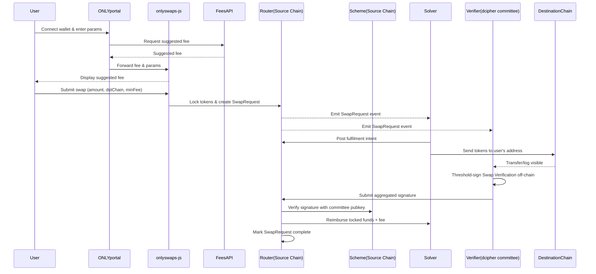

````markdown
# Protocol Architecture

The OnlySwaps protocol utilizes an intent-based architecture secured by threshold cryptography to facilitate cross-chain token transfers. This involves coordination between Users, Solvers, the decentralized dcipher committee, and the Router contracts deployed on supported chains.

## Core Components

### Router Contract (Vaults)

The `Router` contract is the central component of OnlySwaps, deployed on every supported chain. It acts as an on-chain order book and manages the lifecycle of a swap. It also functions as a temporary vault for user funds.

Its key responsibilities include:
1.  **Locking Funds:** Accepting funds from users and creating `SwapRequest` entries.
2.  **Swap Fulfillment:** Facilitating the delivery of funds on the destination chain by Solvers.
3.  **Verification and Reimbursement:** Verifying signatures from the dcipher committee to confirm fulfillment and subsequently releasing the locked funds (plus the fee) to the Solver on the source chain.

The Router is implemented using the UUPS upgradeable pattern, ensuring the protocol can evolve while maintaining security through time-locked, BLS-gated upgrades (via the `ScheduledUpgradeable` contract).

### Solvers

Solvers are off-chain actors who provide liquidity. They monitor the Router contracts for open `SwapRequest` events. When a request meets their criteria, they fulfill it on the destination chain and are later reimbursed on the source chain upon verification.

### dcipher Committee (Verifiers)

The dcipher committee members run the `onlyswaps-verifier` application. They observe events on the destination chain. When a Solver successfully fulfills a request, the committee members collaborate off-chain to generate a threshold signature verifying this action.

### Scheme Contract (BLSBN254SignatureScheme)

The `Scheme` contract contains the cryptographic logic and the committee's public key necessary for the Router to verify the signatures generated by the dcipher committee. OnlySwaps uses the `BLSBN254SignatureScheme`.

This scheme implements BLS signature verification over the BN254 curve. Crucially, it enforces **domain separation**. This ensures that a signature intended for one purpose (e.g., `"swap-v1"`) cannot be replayed for another (e.g., `"upgrade-v1"`). Separate instances of the scheme are deployed for swap verifications and contract upgrades.

## Visualizing the Cross-Chain Flow

The following sequence diagram illustrates the end-to-end flow of a cross-chain swap.



### Flow Explanation

1.  **Fee Discovery (Optional):** The user interface queries the centralized Fees API to get a recommended fee based on current network conditions and liquidity.
2.  **Swap Request Initiation:** The user submits the swap transaction to the Router contract on the Source Chain. The tokens (amount + fee) are locked, and a `SwapRequested` event is emitted with a unique `requestId`.
3.  **Solver Fulfillment:** A Solver observes the event and fulfills the request by sending the tokens to the user on the Destination Chain.
4.  **Verification:** The dcipher committee (Verifiers) observes the successful transfer on the Destination Chain.
5.  **Threshold Signing:** The committee members collaborate off-chain to generate a BLS threshold signature verifying the fulfillment.
6.  **Reimbursement:** The aggregated signature is submitted to the Router on the Source Chain. The Router verifies the signature via the Scheme contract. If valid, the Router releases the locked funds and the fee to the Solver and marks the `SwapRequest` as complete (`executed`).

<!-- end list -->

````

